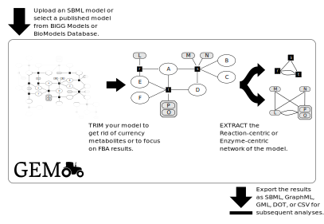

# GEMtractor: Extracting Views into Genome-scale Metabolic Models

### Authors
* Martin Scharm
* Olaf Wolkenhauer
* Mahdi Jalili
* Ali Salehzadeh-Yazdi

### Affiliations
* Department of Systems Biology and Bioinformatics, University of Rostock, 18051 Rostock, Germany

* Hematology, Oncology and SCT Research Center, Tehran University of Medical Sciences, Tehran, Iran

### Rules

* approx 1000 words
* Software or data must be freely available to non-commercial users. 
* Availability and Implementation must be clearly stated in the article.
* Additional Supplementary data can be published online-only by the journal. This supplementary material should be referred to in the abstract of the Application Note.
* The name of the application should be included in the title.
* $190 per excess page - so we should try to stay within 2 pages

## Cover letter
* explaining the suitability of the paper for Bioinformatics

## Abstract
* **Summary:** Computational metabolic models in systems biology typically encode for multipartite graphs of species, reactions, and enzymes. Construction and topological analysis of these complex networks is still challenging.
The GEMtractor is a web-based tool to trim models encoded in SBML and it can also be used to extract subnetworks, focussing on reaction and enzyme-centric views.
* **Availability and Implementation:** The GEMtractor is licensed under the terms of [GPLv3](https://www.gnu.org/licenses/gpl-3.0.en.html) and developed at [github.com/binfalse/GEMtractor/](https://github.com/binfalse/GEMtractor/) -- a public version is available at [sbi.uni-rostock.de/gemtractor](https://www.sbi.uni-rostock.de/gemtractor).
* **Contact:** ..@..

## 197 words till here

## Introduction
In the most basic abstraction level, biological phenomenon can be quantified as mathematical graphs and thus graph theory is employed to the analysis of molecular topology. Genome-scale metabolic models (GEMs) describe the assiciations between genes, proteins and reactions of entire metabolic contents of a particular organism.Such models are typically encoded in multipartite graphs, whose vertices can be categorised as metabolites, reactions, and enzymes.
Due to the intrinsic complexity of that graph it is challenging to analyse and compare the molecular topology of metabolic networks.
Extracting the reaction-centric (links of reactions) or enzyme-centric (links of enzymes) view onto the metabolism simplifies the graph structure and shifts its perspective -- from kinetic interactions to phenotypical connections. Thus, it opens opportunities for novel topological analysis of the metabolism (Ref: An Introduction to Metabolic Networks and Their Structural Analysis).
In fact, enzyme-centric networks provide us a critical precursor of physiological representation from genomics data, by determining metabolic distances between enzymes.

The idea of extracting and analysing the enzyme-centric network of a GEM is not new and there are already two tools claiming to do so.
However, [Horne et al 2004](https://academic.oup.com/bioinformatics/article/20/13/2050/241978) is not available any more and the authors are not reachable, and [Asgari et al 2018](https://www.ingentaconnect.com/contentone/ben/cbio/2018/00000013/00000001/art00015) apparently mistook the reaction-centric network for an enzyme-centric network.

Here we introduce the GEMtractor, a web-based tool to extract reaction-centric and enzyme-centric views metabolic networks.
In addition, the GEMtractor allows for trimming of models to, for example, remove currency metabolites or to focus on context-based models.
The GEMtractor is a free software and easy to deploy to third party infrastructures, including an increased privacy and speed.

## Technical Notes
The GEMtractor is a Django web application, that we developed with a focus on privacy, compatibility and speed.
The interactive front-end is implemented using jQuery and designed using W3CSS.
Thus, it works in all modern browsers as well as on mobile devices; there is no need for registration.
Figure XX shows a typical workflow when using the GEMtractor.

The GEMtractor uses libsbml [Bornstein et al 2008](https://www.ncbi.nlm.nih.gov/pubmed/18252737) to support all models encoded in SBML ([sbml.org](http://sbml.org/Main_Page)).
To start an analysis, the user needs to select a model. Users may upload their own models or choose a published model form BiGG ([King et al 2016](https://academic.oup.com/nar/article/44/D1/D515/2502593)) or BioModels ([Chelliah et al 2015](https://nar.oxfordjournals.org/content/early/2014/11/20/nar.gku1181)).
Decoding the metabolite-reaction network from the SBML is straightforward.
However, understanding which enzyme combinations catalyse a certain reaction is a bit tricky.
The GEMtractor supports to flavours of gene-product associations: Using the reactions' notes and proper annotations using the SBML FBC package [Olivier et al 2015](https://co.mbine.org/specifications/sbml.level-3.version-1.fbc.version-2.release-1).
Some reactions lack both annotations -- in those cases, the GEMtractor assumes, that there is an implicit enzyme whose identifier matches the identifier of the reaction, prefixed with `reaction_`.
We call these invented enzymes *fake enzymes.*

As soon as the model is validly decoded, the user can start trimming entities.
The front-end lists all species, reactions, enzymes, and enzyme complexes in individual tables, which can for example be sorted by occurences.
Thus, it is comparatively easy to get rid of currency metabolites.
The filters can also programmatically applied using a text-field, so users may save their filters offline or paste filters obtained by their FBA results.
Every change on the filters is evaluated at the front-end to check for possible inconsistencies.
For example, if an enzyme is to be removed, it may be necessary to also remove all enzyme complexes, in which it participates.
Such inconsistencies are highlighted and summarised at the top of the page to inform the user.

The user may then decide to extract a specific view from that trimmed model.
In the reaction-centric network consecutive reactions are linked.
That means, if a reaction `r` produces a metabolite that is consumed by the reaction `s`, there will be a link from `r` to `s`.
Similarly, the enzyme-centric network links consecutive enzymes and enzyme complexes.
For example, if `r` is catalysed by `X` *or* `Y` (alternatives, both can catalyse) and `s` is catalyse by `M` *and* `N` (both are neccesary for the catalysation), then there will be two links: From `X` to `M` *and* `N` and from `Y` to `M` *and* `N`.
Thus, both the reaction-centric and the enzyme-centric network are directed, unipartite graphs.

Finally, the obtained graph can then be exported into an exchangeable format.
The GEMtractor currently supports SBML, DOT, GML, GraphML and CSV as output formats.
In case of SBML, it tries to preserve as many annotations as possible.
For example, the *species* in the reaction-centric network will have all the annotations of the reactions in the original metabolite-reaction network.
Similarly, if the gene products were annotated using the FBC package, they will be annotated in the exported file.

In addition to the web browser front-end, the GEMtractor provides a decent API.
Trimming an extraction tasks can be encoded in JSON jobs and sent to the API endpoint, which will take care of the computation and immediately return the results.
Client implementations in several languages are shipped with the source code.
Due to Django's architecture, the heart of the GEMtractor can be used as a Python module if a network connection is undesired.

Even though the GEMtractor can basically handle all valid SBML models, some models cause problems.
For example, the computation time increases a lot with model sizes, which may cause timeouts at the web server.
Similarly the maximum upload size allowed by the webserver is quickly hit, so not every model may be uploadable.
[//]: <> (However, we configured our limits to be useful for the majority of analyses on GEMs.)
Furthermore, some models may have invalid gene associations while being valid SBML.
That is, because in SBML prior to level 3 there was no standard on encoding the gene associations -- they were basically encoded in a free-text field, which is of course error-prone.
This is primarily the case for models from BioModels, as those models are often encoded in SBML level 2.
If the GEMtractor finds a gene association but is not able to parse it, it will stop and report an error.

Our public GEMtractor instance at [sbi.uni-rostock.de/gemtractor](https://www.sbi.uni-rostock.de/gemtractor) should be useful for the majority of analyses on GEMs.
However, if you still need extended quotas, cache quotas, web server upload limits or timeouts, you are invited to install your own GEMtractor, which is no magic at all.
The installation process is documented on the GEMtractor's website and in the source code.
It requires a Python application server (e.g. gunicorn) to deal with the dynamic pages, and a default web server (e.g. nginx) to serve the static files.
However, if you are happy with Docker, installing a Gemtractor boils down to a single command line.

As documentation is key to dissemination, the GEMtractor comes with an extensive FAQ, proper Python documentation and example client implementations in different programming languages.
Automatic tests cover most of its source code to prevent future programming mistakes and the GEMtractor exposes a monitoring endpoint to keep an eye on its health.

## Conclusion

Although the GEMtractor was build to trim genome scale metabolic models, it is basically applicable to any sbml model. You won't get useful enzyme networks, as kinetic models typically lack the gene association annotations, but you can still trim models to focus on submodels or extract the reaction centric network to topologically analyze them.

## Acknowledgements

We would like to thank Markus Wolfien and Tom Gebhardt for creative brainstormings ;-)

## Funding
This study was conducted in the frame of ERACoBioTech project BESTER (031B0594B) provided by Federal Ministry of Education and Research (BMBF).

